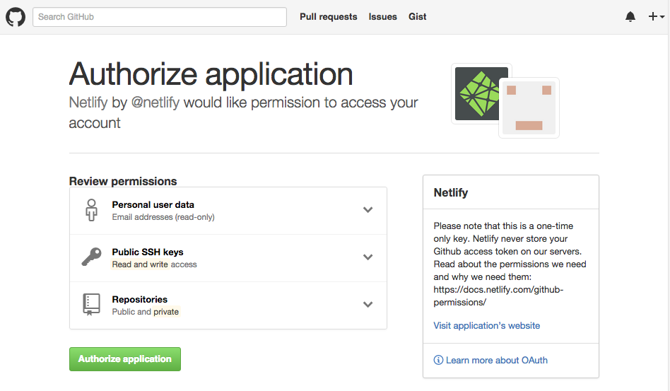

Hoje vamos ver como hospedar um site feito em Gatsby na plataforma Netlify.
Esse meu blog foi feito em Gatsby, que é um gerador de sites estáticos (mas não só isso).

A primeira coisa a ser feita é criar um repositório no GitHub, GitLab ou BitBucket para subir o seu projeto (porém vou utilizar o GitHub no exemplo).

Feito isso acesse https://www.netlify.com/ e crie sua conta.

Agora já logado você verá o seguinte botão para criar um novo site a partir do GitHub


Após isso será apresentada a tela para selecionar o provedor Git.


Como estou utilizando o GitHub, ao selecionador esse provedor Git é apresentada uma tela parecida com essa



Clicando em `Authorize application` irá aparecer a opção para instalar o netlify em todos os repositórios ou selecionar um repositório. Sugiro prestar atenção nessa opção e selecionar somente o repositório desejado.

Com o repositório desejado selecionado é a hora de configurar o deploy.


Selecione o branch do seu repositório (se for padrão é o master). O comando de build para sites gerados com Gatsby é o:
```javascript
gatsby build
```

Clique em deploy e pode ir tomar um café, seu site está sendo preparado.

Para incluir um domínio customizado é só clicar no botão “Add Custom Domain”


Conclusão

Viu só como é rápido e fácil! Para sites estáticos simples e blogs pessoais a versão free do Netlify atende super bem, e possui muitas opções avançadas.

Para ver um passo a passo de hospedar site Gatsby na própria doc do Netlify [clique aqui][netlify-doc]

Dica Bônus: Publique seus textos e artigos em blogs pessoais ou em outras plataformas que não sejam o Medium. Infelizmente essa plataforma mesmo sendo muito boa tem políticas internas muito ruins e que mudam constantemente.

[netlify-doc]: https://www.netlify.com/blog/2016/02/24/a-step-by-step-guide-gatsby-on-netlify/
